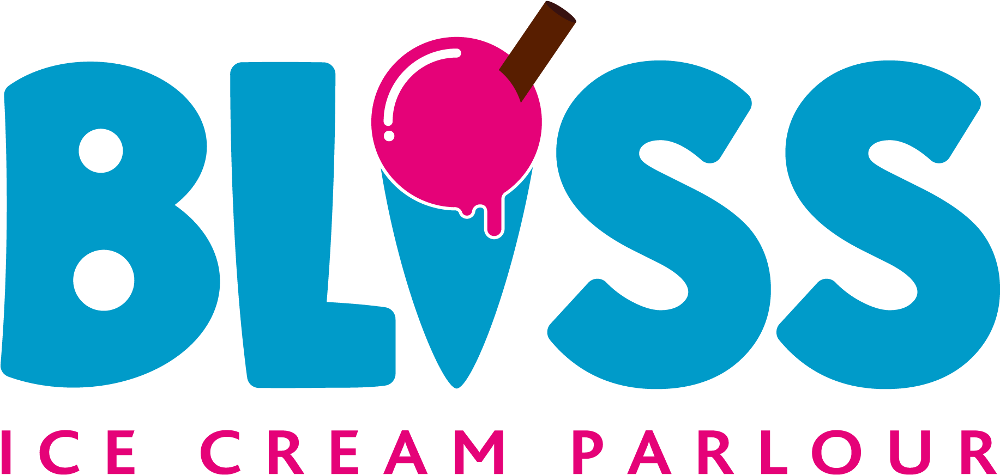

# Bliss IceCream Parlour website

## *Discription* : 
This is a project about creating a website for an ice cream parlour.
This project was conducted as an exercise during a learnership hosted by [Girlcode](https://github.com/GirlCodeZA)

It was built using **HTML** , **CSS** and **JavaScript**.
## Tools used :  *Notepad++* and *Visual Studio Code*

## Features to be implemented in the future :
* Create a database to save login and sign ups.

### How to Install this Project
 For now to have the project on your personal computer all you have to do is copy and clone it to your machine.

### How to Use The Project
1. Open the project on a code editor (VS CODE PREFERD)
2. Right click *index.html*
3. Select *Open with live share* OR select *Copy path* and paste the link in a browser.
4. Then you will see the website and be able to navigate through it.

### Contributions
Contributions are welcome. To contribute you can open a new issue or do a pull request.

### Author : **[Nonny Mahao](https://github.com/Nonny-Mahao)** 

### Licence
This project is [MIT](https://www.google.com) licensed.